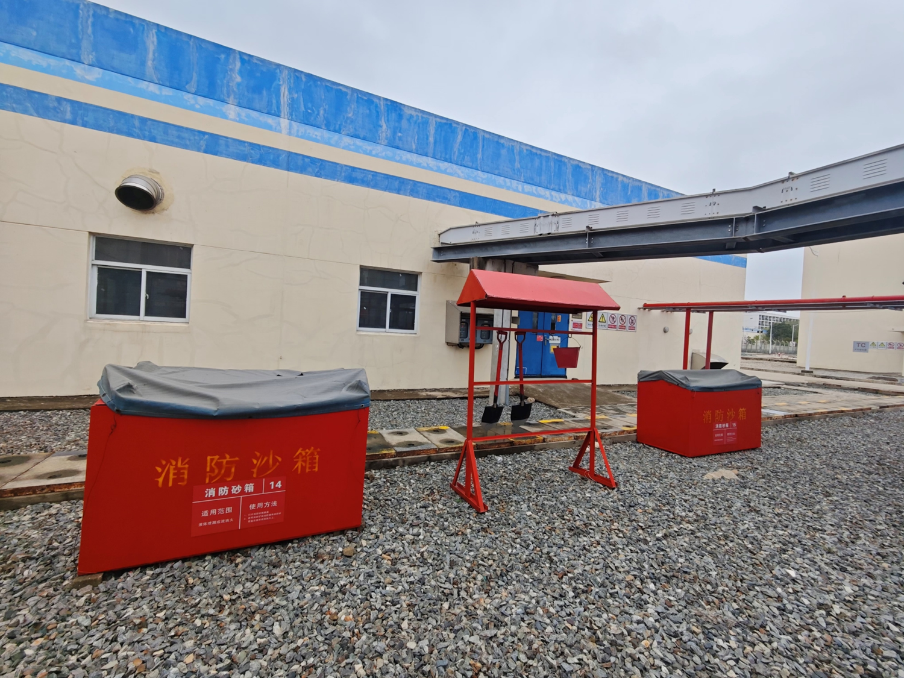
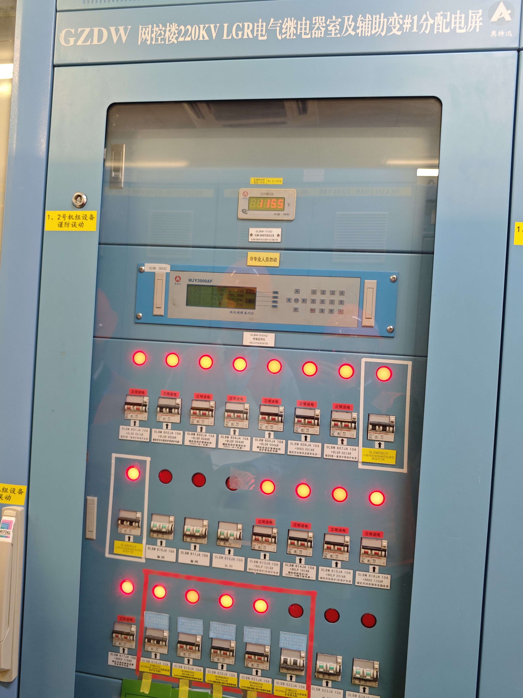
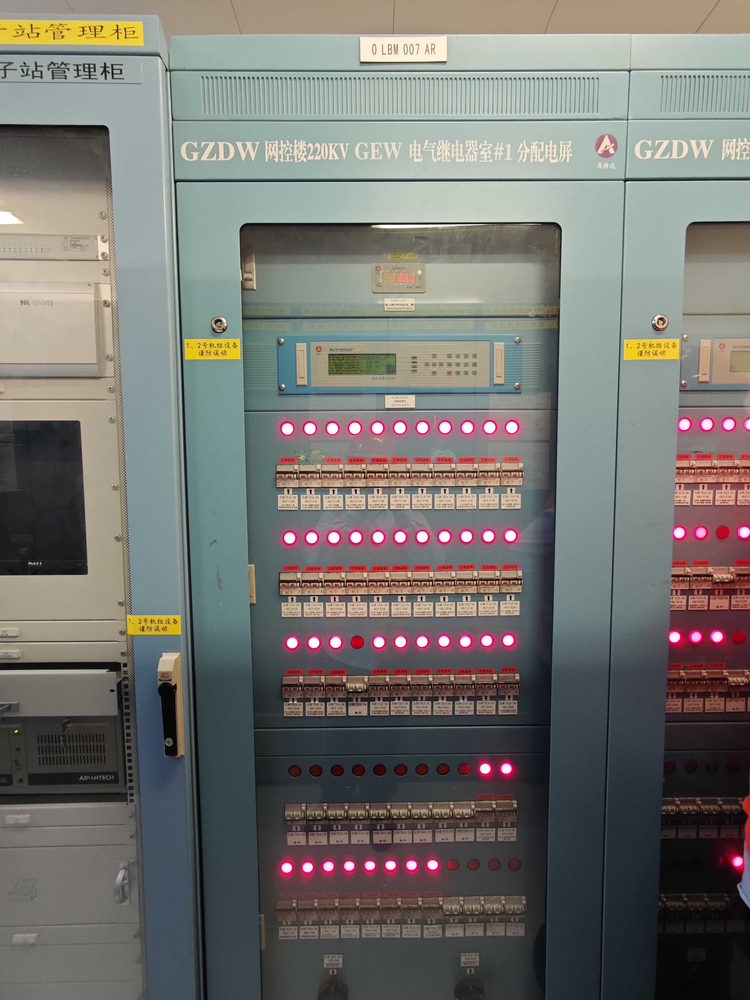

- 1    PDA是否已经切换账号
- 2    确认所有柜门和防火门关闭
- 3    检查临时打开的防火屏障有无许可证，有异常立即通知主控
- ---
- 4    检查清水池应急取水口是否正常
	- {:height 200, :width 252}  {:height 199, :width 146}
- ---
- 5    天气是否正常（具备室外变压器、线路的巡检条件）
- ---
- 6   【大修免扰设备】昌核线线路外观正常，无断线
	- {:height 289, :width 371}
- 7   【大修免扰设备】各串出线瓷套管接线完好，无裂纹，无异响
- 8    关灯，检查高压下引线，绝缘瓷瓶处无发电
- 9    各引线无剧烈摆，松驰现象
- 10   门架各设备接地线完好
	- {:height 318, :width 226}  {:height 408, :width 225}
- 11   昌核线进线门架内地面平整，无杂草
- ---
- 12   【扫码】TD厂房内氧气浓度正常，SF6浓度正常
	- {:height 231, :width 313}
- 13   检查TD厂房内照明正常
- 14   TD厂房内轴流风机运行正常
-
- 15   直流分屏无故障报警，电压正常（115V左右）
	- {:height 299, :width 216} {:height 204, :width 443}
- 16   直流分屏各断路器控制备用电源在分闸位置
-
- 17   9LGR602CR上各SF6压力表参数正常
	- {:height 314, :width 219} {:height 299, :width 433}
-
- 18   房间内照明正常，地面洁净，无积水
-
- 19   9LGR501CR柜光字牌无异常报警
	- {:height 386, :width 248}
- 20   9LGR501CR柜上开关、刀闸、地刀位置指示正常
-
- 21   9LGR503CR柜光字牌无报警
	- {:height 483, :width 256}
- 22   9LGR503CR柜上开关、刀闸、地刀位置指示正常
-
- 23   9LGR500CR柜光字牌无异常报警
	- {:height 368, :width 260}
- 24   9LGR500CR柜上开关、刀闸、地刀位置指示正常
-
- 25   9LGR502CR柜光字牌无报警
	- {:height 322, :width 255}
- 26   9LGR502CR柜上开关、刀闸、地刀位置指示正常
-
- ==27   各断路器缓冲油壶无漏油现象==
	-
- ---
- ==28   1\#辅变正在运行==
	- {:height 256, :width 516}
	- 通过运行时有震动和声音判断？
- 29   运行中辅变无异音
- 30   1\#辅变冷却风扇运行--1号
	- {:height 305, :width 226}
- 31   1\#辅变冷却风扇运行--2号
- 32   1\#辅变冷却风扇运行--3号
- 33   1\#辅变冷却风扇运行--4号
- 34   变压器各接口、油枕无渗漏油现象
- 35   辅变事故放油阀未动作
	- {:height 321, :width 207}
- 36   有载调压箱上部小油枕油位正常
	- {:height 363, :width 283} {:height 336, :width 284}
- 37   主体油位计读数
	- 
- 38   辅变油面温控器一
- 39   辅变油面温控器二
- 40   辅变绕组温度
- 41   柜内各切换开关位置--SA1位置
	- {:height 395, :width 225} {:height 307, :width 393}
	- ==控制电源位置需要打开才能看见==
- 42   柜内各切换开关位置--SA2位置
- 43   柜内各切换开关位置--SA3位置
- 44   控制柜电源Ⅰ（QF1）位置
- 45   控制柜电源Ⅱ（QF2）位置
- ---
- 46   2\#辅变正在运行
- 47   运行中辅变无异音
- 48   2\#辅变冷却风扇运行--1号
- 49   2\#辅变冷却风扇运行--2号
- 50   2\#辅变冷却风扇运行--3号
- 51   2\#辅变冷却风扇运行--4号
- 52   变压器各接口、油枕无渗漏油现象
- 53   辅变事故放油阀未动作
- 54   有载调压箱上部小油枕油位正常
- 55   主体油位计读数
- 56   辅变油面温控器一
- 57   辅变油面温控器二
- 58   辅变绕组温度
- 59   柜内各切换开关位置--SA1位置
- 60   柜内各切换开关位置--SA2位置
- 61   柜内各切换开关位置--SA3位置
- 62   控制柜电源Ⅰ（QF1）位置
- 63   控制柜电源Ⅱ（QF2）位置
- ---
- 64   消防铲完好，消防沙箱防水布完好
	- 
- ---
- 65   JX6kV配电间内照明正常，温度正常
- 66   【扫码】9LGR002TB上各开关柜故障指示灯灭
	- {:height 315, :width 417}  {:height 201, :width 268}
- 67   各开关柜内无异常放电声响
- 68   9LGR201TU柜上电压表线电压(5.7-6.3kV)
	- {:height 301, :width 301} {:height 186, :width 195}
- 69   9LGR204JA柜上电压表线电压(5.7-6.3kV)
	- {:height 425, :width 306}
- 70   9LGR001TB上各开关柜故障指示灯灭
- 71   各开关柜内无异常放电声响
- 72   9LGR101TU柜上电压表线电压(5.7-6.3kV)
- 73   9LGR104JA柜上电压表线电压(5.7-6.3kV)
-
- 74   黑色电源模块工作正常，绿色电源指示灯亮
	- {:height 266, :width 330}
- 75   控制屏无故障“ER”红灯
- 76   直流分屏无故障报警，电压正常（115V左右）
	- {:height 265, :width 320}
- 77   直流分屏各电源进线开关位置正常
	- {:height 463, :width 329}
- 78   0LKK运行正常，三相电源指示灯亮
	- {:height 254, :width 328}
- ---
- 79   检查9JDT001AR处于自动位置；
	- {:height 377, :width 275}
- 80   检查9JPT001AR雨淋阀控制器处于自动位置；
	- {:height 382, :width 294}
- 81   检查9JPT002AR雨淋阀控制器处于自动位置；
- 82   检查9JDT9101AR气体灭火控制器处于自动位置；
	- {:height 314, :width 255}
- 83   两个七氟丙烷储气瓶压力指示正常（20-33bar）
	- {:height 384, :width 276}
- 84   轴流风机运转正常
- 85   雨淋阀9JPT006VT上腔压力061LP
	- {:height 391, :width 295}
- 86   雨淋阀9JPT006VT下腔压力062LP
- 87   雨淋阀组9JPT006VT无漏水现象
- 88   雨淋阀9JPT007VT上腔压力071LP
- 89   雨淋阀9JPT007VT下腔压力072LP
- 90   雨淋阀组9JPT007VT无漏水现象
- 91   检查二级干预队物资可用性
	- {:height 239, :width 324}
- ---
- 92   【大修免扰设备】线路外观正常，无断线
	- {:height 320, :width 400}
- 93   【大修免扰设备】各串出线瓷套管接线完好，无裂纹，无异响
- 94   关灯，检查高压下引线，绝缘瓷瓶处无发电
- 95   【大修免扰设备】各引线无剧烈摆，松驰现象
- 96   门架各设备接地线完好
- 97   主电源进线门架区域内地面平整，无杂草
- ---
- ==98   进行网控区域内的GIL管线巡视，查看7\#GIL气体小室无报警，并进入气体小室内查看1和2号机GIL气体间隔的六氟化硫就地压力表，读数要求大于0.6MPa==
- 99   进行网控区域内的GIL管线巡视，查看6\#GIL气体小室无报警，并进入气体小室内查看1和2号机GIL气体间隔的六氟化硫就地压力表，读数要求大于0.6MPa
- 100  进行网控区域外的GIL管线巡视，查看5\#GIL气体小室无报警，并进入气体小室内查看1和2号机GIL气体间隔的六氟化硫就地压力表，读数要求大于0.6MPa
- 101  【扫码】进行网控区域内的GIL管线巡视，查看4\#GIL气体小室无报警，并进入气体小室内查看1和2号机GIL气体间隔的六氟化硫就地压力表，读数要求大于0.6MPa
- ---
- 102  【扫码】TB厂房内氧气浓度正常，SF6浓度正常
- 103  TB厂房室内照明正常
- 104  厂房内轴流风机运行正常
-
- 105  0GEW401CR柜光字牌无异常报警
	- {:height 369, :width 293}
- 106  0GEW401CR进行试灯
	- {:height 195, :width 296}
- 107  0GEW401CR柜上开关、刀闸、地刀位置指示正常
- 108  0GEW402CR柜光字牌无异常报警
- 109  0GEW402CR进行试灯
- 110  0GEW402CR柜上开关、刀闸、地刀位置指示正常
- 111  0GEW403CR柜光字牌无异常报警
- 112  0GEW403CR进行试灯
- 113  0GEW403CR柜上开关、刀闸、地刀位置指示正常
- 114  0GEW303CR柜光字牌无异常报警
- 115  0GEW303CR进行试灯
- 116  0GEW303CR柜上开关、刀闸、地刀位置指示正常
- 117  0GEW302CR柜光字牌无异常报警
- 118  0GEW302CR进行试灯
- 119  0GEW302CR柜上开关、刀闸、地刀位置指示正常
- 120  0GEW301CR柜光字牌无异常报警
- 121  0GEW301CR进行试灯
- 122  0GEW301CR柜上开关、刀闸、地刀位置指示正常
-
- 123  0GEW602CR各气室SF6压力微水正常，无泄漏报警
	- {:height 397, :width 228}
- 124  GIL壳体光纤温度在线监测装置运行正常
	- {:height 430, :width 237}
- 125  GIL壳体光纤温度在线监测画面上无故障报警
-
- 126  直流分屏无故障报警，电压正常（115V左右）
	- {:height 334, :width 237}
- 127  直流分屏各断路器控制备用电源在分闸位置
-
- 128  0GEW002CR柜光字牌无异常报警
- 129  0GEW002CR进行试灯
- 130  0GEW002CR柜上地刀位置指示正常
- 131  0GEW001CR柜光字牌无异常报警
- 132  0GEW001CR进行试灯
- 133  0GEW001CR柜上地刀位置指示正常
- 134  0GEW605CR220kVGIS&GIL局放在线监测系统运行正常，无故障告警
	- {:height 202, :width 250}
- 135  0GEW203CR柜光字牌无异常报警
- 136  0GEW203CR进行试灯
- 137  0GEW203CR柜上开关、刀闸、地刀位置指示正常
- 138  0GEW202CR柜光字牌无异常报警
- 139  0GEW202CR进行试灯
- 140  0GEW202CR柜上开关、刀闸、地刀位置指示正常
- 141  0GEW201CR柜光字牌无异常报警
- 0    0GEW201CR进行试灯
- 142  0GEW201CR柜上开关、刀闸、地刀位置指示正常
- 143  0GEW101CR柜光字牌无异常报警
- 144  0GEW101CR进行灯试
- 145  0GEW101CR柜上开关、刀闸、地刀位置指示正常
- 146  0GEW102CR柜光字牌无异常报警
- 147  0GEW102CR进行试灯
- 148  0GEW102CR柜上开关、刀闸、地刀位置指示正常
- 149  0GEW103CR柜光字牌无异常报警
- 150  0GEW103CR进行试灯
- 151  0GEW103CR柜上开关、刀闸、地刀位置指示正常
- 152  各断路器缓冲油壶无漏油现象
- ---
- 153  TC楼内过道和各房间内照明正常
- 154  0LBM/0LBN各充电器模块运行正常，无故障灯亮
	- 看图片左侧设备
	- {:height 438, :width 331} {:height 438, :width 331}
- 155  绝缘仪运行正常，无报警
	- {:height 298, :width 356}
- ---
- 156  001BT蓄电池输出电压表401ID读数
	- 图右侧设备
	- {:height 482, :width 358}
- 157  0LBM母线电压表403ID读数
	- 图右侧设备
	- {:height 503, :width 367}
- 158  002BT蓄电池输出电压表501ID读数
- 159  0LBN母线电压表503ID读数
-
- 160  UPS运行正常，盘面无报警
	- {:height 337, :width 386}
- 161  0LNM交流母线电压表504ID读数
	- {:height 354, :width 404}
- 162  0LNN交流母线电压表514ID读数
- ---
- 163  蓄电池间地面洁净，无异味，照明温度正常
- 164  检查通信蓄电池间负压正常
- 165  记录通信电池室温度
- 166  记录通信电池室湿度
- 167  检查直流蓄电池间负压正常
- 168  记录直流蓄电池室温度
- 169  记录直流蓄电池室湿度
- 170  蓄电池间内空调运行正常，一个轴流风机运行
- 171  蓄电池组外观完好，液位正常，无漏液
- 172  各蓄电池间洗眼器可用，出水水质正常
- ---
- 173  检查0JDT9102AR气体灭火控制器处于自动位置；
- ---
- 174  房间地面洁净，无异味，照明温度正常
- 175  【扫码】各通信配电屏运行正常，无故障报警
- 176  0LCM001AR直流电压读数
- 177  0LCM002AR直流电压读数
	- {:height 489, :width 345}
- ---
- 178  各开关抽屉上无故障指示灯亮
- 179  0LKR100TR运行正常，无故障黄灯，并进行灯试
	- 故障灯和灯试按钮都在左边的柜子上
	- 
- 180  0LKR100TR风机联锁正常，绕组温度正常
	- 手动灯不亮就是连锁正常
- 181  0LKT100TR运行正常，无故障黄灯，并进行灯试
- 182  0LKQ三相电源指示灯
- ---
- 183  检查0JDT9101AR气体灭火控制器处于自动位置；
- ---
- 184  电缆间地面洁净，无杂物，照明正常，温度正常
- ---
- 185  【扫码】消防气瓶间地面洁净，无异味，照明温度正常
	- 
- 186  消防气瓶间轴流风机运转正常
- 187  各七氟丙烷储气瓶压力指示正常（20-33bar）
- ---
- 188  检查0JDT9201AR气体灭火控制器处于自动位置；
- ---
- 189  【扫码】各保护柜运行正常，无故障报警
- 190  9KKO001AR辅助变故障滤波装置运行正常
	- {:height 402, :width 286}
- 191  9KKO110AR辅助电源故障录波器柜运行正常
	- {:height 586, :width 413}
- 192  辅助变色谱在线监测控制柜运行正常
	- {:height 542, :width 419}
- 193  直流分屏无故障报警，电压正常（110V左右）
	- {:height 592, :width 436}
- ---
- 194  检查0JDT9302AR气体灭火控制器处于自动位置；
- ---
- 195  各NCS分屏电源模块工作正常，绿色电源指示灯亮
	- 
	- 
- 196  各NCS控制屏无故障“ER”红灯
- 197  PMU装置运行正常
	- 
- 198  时钟系统运行正常
	- 
- 199  直流分屏无故障报警，电压正常（110V左右）
	- 
- 200  检查0JDT9301AR气体灭火控制器1区处于手动，2区自动；
- ---
- 201  【扫码】各保护柜运行正常，无故障报警
- ---
- 202  0KLP501AR稳控主机A柜运行正常
	- 
- 203  0KLP502AR稳控主机B柜运行正常
- 204  各故障录波器柜运行正常，无故障报警
	- 
- 205  直流分屏无故障报警，电压正常（110V左右）
	- 
- ---
- 206  各NCS分屏电源模块工作正常，绿色电源指示灯亮
	- 
- 207  各NCS控制屏无故障“ER”红灯
- 208  直流分屏无故障报警，电压正常（110V左右）
	- 
- ---
- 209  检查0JDT9303AR气体灭火控制器处于自动位置
- ---
- 210  确认NCS系统画面的报警声音正常
- 211  核李I线线电压Uab读数
- 212  核李I线线电压Ubc读数
- 213  核李I线线电压Uca读数
- 214  核李II线线电压Uab读数
- 215  核李II线线电压Ubc读数
- 216  核李II线线电压Uca读数
- 217  核成I线线电压Uab读数
- 218  核成I线线电压Ubc读数
- 219  核成I线线电压Uca读数
- 220  核成II线线电压Uab读数
- 221  核成II线线电压Ubc读数
- 222  核成II线线电压Uca读数
- 223  220kV\#3M母线线电压Uab读数
- 224  220kV\#3M母线线电压Ubc读数
- 225  220kV\#3M母线线电压Uca读数
- 226  220kV\#4M母线线电压Uab读数
- 227  220kV\#4M母线线电压Ubc读数
- 228  220kV\#4M母线线电压Uca读数
- 229  昌核线线电压Uab读数
- 230  昌核线线电压Ubc读数
- 231  昌核线线电压Uca读数
- 232  220kV\#1M母线线电压Uab读数
- 233  220kV\#1M母线线电压Ubc读数
- 234  220kV\#1M母线线电压Uca读数
- 235  35kV昌尾塘线开关3551状态
- 236  35kV昌尾塘线开关3551有功功率P读数
- 237  35kV母线分段开关3513状态
- 238  35kV南尾塘线开关3552状态
- 239  35kV南尾塘线开关3552有功功率P读数
- 240  35kV塘兴变1\#变压器是否运行
- 241  35kV塘兴变1\#变压器油面温度
- 242  35kV塘兴变2\#变压器是否运行
- 243  35kV塘兴变2\#变压器油面温度
- 244  塘兴变35kV\#1M母线线电压
- 245  塘兴变35kV\#3M母线线电压
- 246  塘兴变10kVⅠ段母线线电压
- 247  塘兴变10kVⅡ段母线线电压
- 248  35kV塘兴变监视画面上无线路、母线、开关的故障报警
- ---
- 249  检查0JDT901AR处于自动位置；
- ---
- 250  望远镜查看核成I、II线、核李I、II线，昌核线线路无火情
- ---
- 251  确认所在巡检岗位防火门已经全部关闭，如有防火门故障无法关闭请及时填写缺陷单处理。
- 252  确认所在巡检岗位的一类和二类门已经全部关闭并锁上，如门锁损坏无法锁上，请及时填写缺陷单处理。
- 253  防火屏障临时打开的区域是否有异常，如有异常确认已通知主控
- 254  是否已完成网控岗位值班室7S登记本检查
- 255  PDA电量是否过低，请及时充电